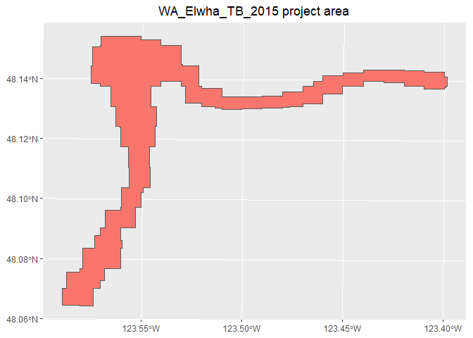

<!-- README.md is generated from README.Rmd. Please edit that file -->

# LidarIndexR

<!-- badges: start -->

<!-- badges: end -->

The goal of LidarIndexR is to provide functions to build index files for
lidar projects.

## Installation

You can install the released version of LidarIndexR from
[CRAN](https://CRAN.R-project.org) with:

``` r
# install.packages("LidarIndexR")
```

And the development version from [GitHub](https://github.com/) with:

``` r
# install.packages("devtools")
devtools::install_github("bmcgaughey1/LidarIndexR")
```

## Example \#1: Create a tile index from files on a remote ftp server

This example creates a tile index for a single lidar project stored in
the USGS rockyftp server. In this case, you have to know the details for
the project including the folder name for the project and the projection
information for the data.

``` r
library(LidarIndexR)
library(sf)
#> Warning: package 'sf' was built under R version 4.0.5
#> Linking to GEOS 3.9.1, GDAL 3.2.1, PROJ 7.2.1
library(ggplot2)
#> Warning: package 'ggplot2' was built under R version 4.0.5
library(viridis)
#> Warning: package 'viridis' was built under R version 4.0.5
#> Loading required package: viridisLite
#> Warning: package 'viridisLite' was built under R version 4.0.5
## Basic example to build an index
URL <- "https://rockyweb.usgs.gov/vdelivery/Datasets/Staged/Elevation/LPC/Projects/AK_BrooksCamp_2012/"
pointFolder <- "laz"
outputFile <- "~/AK_BrooksCamp_2012.gpkg"

# projection info...no easy way to determine this
pointCRS <- 26905

# create index
BuildIndexFromPoints(URL, pointFolder, outputFile, projString = pointCRS, 
                     appendInfo = data.frame("Project" = "AK_BrooksCamp_2012"))
#> Index already exist...skipping:  AK_BrooksCamp_2012.gpkg
#> [1] TRUE
# read the index and display
index <- st_read(outputFile)
#> Reading layer `AK_BrooksCamp_2012' from data source 
#>   `G:\R_Stuff\AK_BrooksCamp_2012.gpkg' using driver `GPKG'
#> Simple feature collection with 41 features and 17 fields
#> Geometry type: POLYGON
#> Dimension:     XY
#> Bounding box:  xmin: 335201.4 ymin: 6484121 xmax: 348234.6 ymax: 6496318
#> Projected CRS: NAD83 / UTM zone 5N
ggplot(index) +
  ggtitle("AK_BrooksCamp_2012 lidar tiles") +
  theme(plot.title = element_text(hjust = 0.5)) +
  geom_sf(aes(fill = PointCount), show.legend = TRUE) +
  scale_fill_viridis()
```


## Example \#2: Create a tile index using a project from the USGS WESM project index

This example creates an index for the same lidar project as Example \#1.
However, this example uses the USGS project index to populate the new
tile index with information regarding the acquisition and to provide
projection information for the project.

You will need to change the line that reads the index to reflect the
location of the WESM index on your computer.

The example requires a local copy of the USGS project index from
[here](ftp://rockyftp.cr.usgs.gov/vdelivery/Datasets/Staged/Elevation/metadata/WESM.gpkg).
The commented code in the example downloads the WESM.gpkg index.

**Note:** The call to  can take quite a bit of time to execute. It
touches every point file on the server to read bounding box information
for the tiles. For projects with thousands of tiles, it can take hours
to build the index.

``` r
library(LidarIndexR)
library(sf)
library(utils)
library(ggplot2)
library(viridis)

# download the USGS WESM index
# utils::download.file("ftp://rockyftp.cr.usgs.gov/vdelivery/Datasets/Staged/Elevation/metadata/WESM.gpkg",
#                      "WESM.gpkg", 
#                      method = "libcurl", 
#                      mode = "wb")

# read the FESM index from a local file
index <- st_read("G:/R_Stuff/EntwineIndex/WESM.gpkg")
#> Reading layer `WESM' from data source `G:\R_Stuff\EntwineIndex\WESM.gpkg' using driver `GPKG'
#> Simple feature collection with 2436 features and 26 fields
#> Geometry type: MULTIPOLYGON
#> Dimension:     XY
#> Bounding box:  xmin: -179.2501 ymin: 13.232 xmax: 179.8547 ymax: 71.507
#> Geodetic CRS:  NAD83
pointFolder <- "laz"
outputFile <- "~/AK_BrooksCamp_2012_Proj.gpkg"

item <- index[which(index$workunit == "AK_BROOKSCAMP_2012"), ]

# create index
BuildIndexFromUSGSProjectIndexItem(item, pointFolder, outputFile)
#> Index already exist...skipping:  AK_BrooksCamp_2012_Proj.gpkg
#> [1] TRUE
# read the index and display
tindex <- st_read(outputFile)
#> Reading layer `AK_BrooksCamp_2012_Proj' from data source 
#>   `G:\R_Stuff\AK_BrooksCamp_2012_Proj.gpkg' using driver `GPKG'
#> Simple feature collection with 41 features and 23 fields
#> Geometry type: POLYGON
#> Dimension:     XY
#> Bounding box:  xmin: 335201.4 ymin: 6484121 xmax: 348234.6 ymax: 6496318
#> Projected CRS: NAD83 / UTM zone 5N
ggplot(tindex) +
  ggtitle("AK_BrooksCamp_2012 lidar tiles") +
  theme(plot.title = element_text(hjust = 0.5)) +
  geom_sf(aes(fill = PointCount), show.legend = TRUE) +
  scale_fill_viridis()
```


## Example \#3: Create an overall polygon for a project from the tile index

This example builds on Example \#2 to create a polygon showing the area
covered by the point tiles.

``` r
# build on the last example to generate a project polygon

tproject <- BuildProjectPolygonFromIndex(
  outputFile,
  item$workunit,
  appendInfo = item[, c("workunit_id", "collect_start", "collect_end", "p_method", "horiz_crs")],
  quiet = FALSE
)
#> Done with: ~/AK_BrooksCamp_2012_Proj.gpkg
# display the project polygon
ggplot(tproject) +
  ggtitle(paste0(item$workunit, " project area")) +
  theme(plot.title = element_text(hjust = 0.5)) +
  geom_sf(aes(fill = PID), show.legend = FALSE)
```


